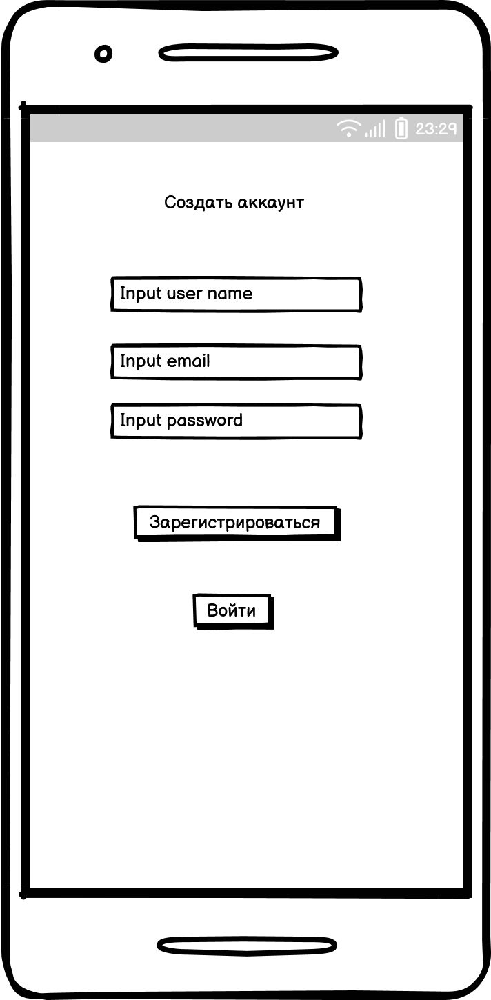
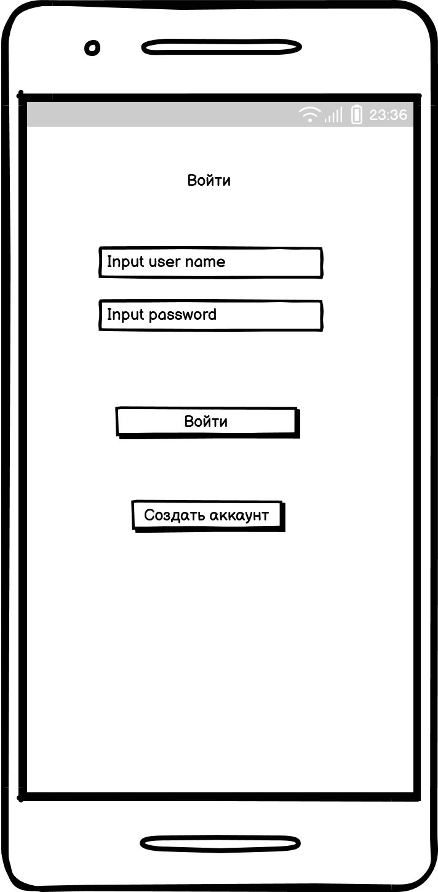
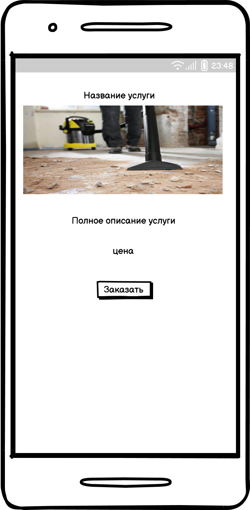

# Clining App

## **Оглавление**
- [1. Введение](#intro)
- [2. Требования пользователя](#user_requirements)
  - [2.1 Программные интерфейсы](#interfaces)
  - [2.2 Интерфейс пользователя](#ui)
  - [2.3 Характеристики пользователей](#user_characteristics)
  - [2.4 Предположения и зависимости](#assumptions)
-[3. Системные требования](#system_requirements)
  - [3.1 Функциональные требования](#functional_requirements)
  - [3.2 Нефункциональные требования](#non_functional_requirements)

## **1. Введение**

**Название проекта:** Clining App

**Технологии и инструменты разработки:**

•	Язык разработки: Kotlin.

•	Фреймворк для создания UI: Jetpack Compose.

•	Среда разработки: Android Studio.

**Описание проекта:**  
Проект представляет собой мобильное приложение для заказа клининговых услуг, с возможностью ознакомления с описанием услуг.

**Границы проекта:**  
Приложение не предоставляет функций оплаты картами.

## **2. Требования пользователя**

### **2.1 Программные интерфейсы:**

Продукт будет взаимодействовать с внешними системами:

•	Firebase Authentication для авторизации и хранения данных пользователей.

### **2.2 Интерфейс пользователя:**

Приложение будет содержать следующие основные интерфейсы:

• Страница создания аккаунта: Экран для ввода данных пользователя (логин,пароль и почта).

 

• Страница авторизации: Экран для ввода данных пользователя (логин и пароль).
  
  

• Главная страница: Список предоставляемых услуг.
  
  

• Страница с конкретной услугой: 
  
  

Пример взаимодействия:

| Действие пользователя                                | Реакция системы                                                |
|------------------------------------------------------|----------------------------------------------------------------|
| Ввод логина,пароля и почты нажимает "Создать аккаунт"| Проверка данных и регистрация                                  |
| Нажимает на кнопку "Войти"                           |  Проверка данных и вход в приложение                           |
| Скроллит по услугам                                  |  Показ возможных услуг                                         |
| Нажимает на кнопку "Заказать"                        | Открывается конкретная улуга                                   |

### **2.3 Характеристики услуг:**

•	Описание услуги и её цена

### **2.4 Предположения и зависимости:**

•	Все пользователи должны иметь подключение к интернету для синхронизации данных с облаком.

•	Приложение будет работать только на устройствах с Android 7.0 и выше.

## **3. Системные требования**

### **3.1 Функциональные требования:**
	
1.	Авторизация через Firebase должна быть обязательной для всех пользователей.
	
2.	Приложение должно поддерживать управление жестами для выполнения определённых действий, таких как увеличение картинки.
   
3.	Приложение должно поддерживать синхронизацию данных с облаком (Firebase).

4.	Поддержка темной и светлой темы интерфейса.

### **3.2 Нефункциональные требования:**

•	Надёжность: Приложение должно быть устойчивым к потерям соединения с интернетом, с возможностью локального хранения данных и последующей синхронизации.

•	Безопасность: Данные пользователей должны быть защищены, а авторизация — проводиться через надёжную систему (например, Firebase Authentication).

•	Производительность: Приложение должно загружаться и работать плавно на большинстве современных устройств.

•	Удобство использования: Интерфейс должен быть интуитивно понятным, особенно для пользователей с базовыми техническими навыками.
